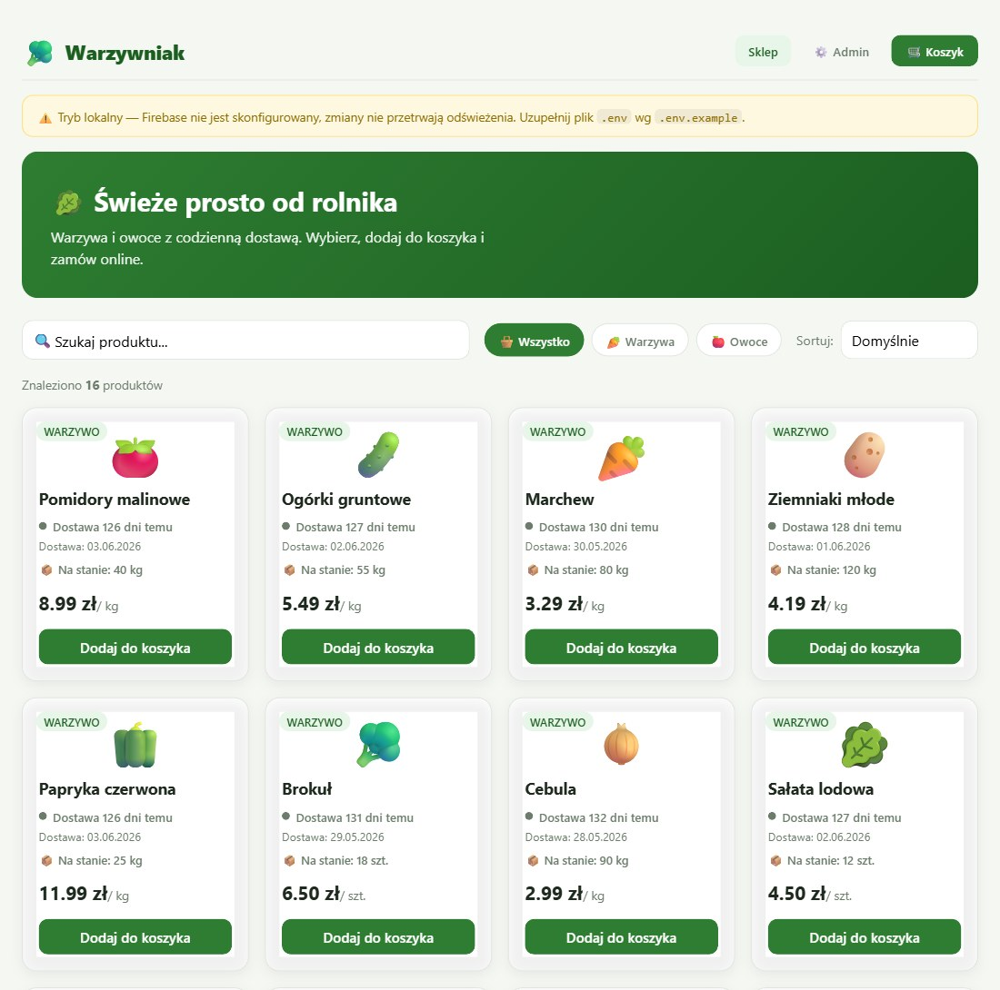
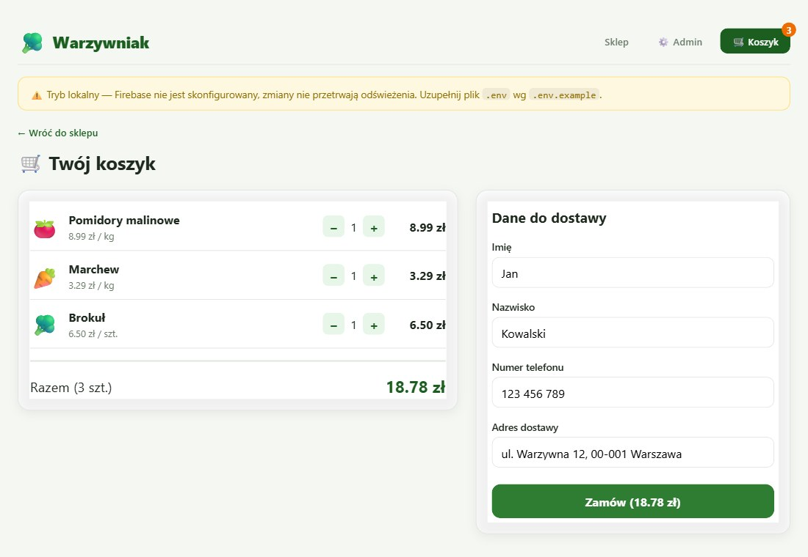

# 🥬 Warzywniak — sklep internetowy z warzywami i owocami

> SPA w **Vue 3 + Vite** z backendem w **Firebase Firestore**: katalog z filtrami i wyszukiwarką, koszyk pilnujący stanów magazynowych, formularz zamówienia z walidacją i panel administratora. Synchronizacja danych na żywo.


| Sklep | Koszyk i zamówienie |
|---|---|
|  |  |

## Dlaczego powstał ten projekt

Projekt zaliczeniowy z przedmiotu **PWAG** (Uniwersytet Śląski, Informatyka, III rok). Zadanie polegało na zbudowaniu działającego sklepu w nowoczesnym frameworku frontendowym. Postawiłem sobie dodatkowe wymagania, żeby projekt był bliższy prawdziwej aplikacji:

- **prawdziwy backend zamiast danych w pamięci** — produkty, stany i zamówienia trzymane w Firestore, zachowane po odświeżeniu strony,
- **spójność stanów magazynowych** — nie da się kupić więcej, niż jest na magazynie, a złożenie zamówienia zmniejsza stan atomowo,
- **aplikacja działa od razu po sklonowaniu** — bez konfiguracji Firebase uruchamia się w trybie lokalnym, więc można ją obejrzeć bez zakładania konta w chmurze.

## Funkcje

**Klient**
- katalog produktów z filtrami *Wszystko / Warzywa / Owoce*, wyszukiwarką po nazwie i sortowaniem po świeżości (dacie dostawy) i cenie,
- karta produktu z typem, datą dostawy („dostawa X dni temu”) i aktualnym stanem magazynowym,
- koszyk z licznikiem ilości, który nie pozwala przekroczyć dostępnego stanu i sam się przycina, gdy stan spadnie w trakcie zakupów,
- formularz dostawy (imię, nazwisko, telefon, adres) z walidacją pól i komunikatami o błędach.

**Administrator**
- logowanie do panelu admina,
- edycja daty dostawy i stanu magazynowego każdego produktu — zmiany od razu widzą wszyscy klienci (`onSnapshot`).

## Stack i decyzje techniczne

| Obszar | Rozwiązanie | Dlaczego |
|---|---|---|
| UI | Vue 3 (`<script setup>`, Composition API) | komponenty jednoplikowe i reaktywność bez dodatkowych bibliotek |
| Stan | własny store na `reactive()` + `computed()` | jeden widok, kilka komponentów — Pinia byłaby tu nadmiarowa |
| Backend | Firebase Firestore | brak własnego serwera, synchronizacja na żywo, darmowy plan |
| Zamówienia | `writeBatch` + `increment(-qty)` | atomowe zmniejszenie stanów wielu produktów naraz |
| Sieć | `experimentalAutoDetectLongPolling` | naprawia „wieczne ładowanie”, gdy sieć lub rozszerzenie blokuje WebChannel |
| Konfiguracja | zmienne `VITE_*` w `.env` (poza repozytorium) | klucze projektu nie trafiają do Gita |
| Seed | automatyczne zasilenie pustej kolekcji `products` | nowa baza od razu ma dane |

## Uruchomienie

Wymagany Node.js `^20.19` lub `>=22.12`.

```sh
npm install
npm run dev        # http://localhost:5173
npm run build      # build produkcyjny do dist/
```

Bez pliku `.env` aplikacja działa w **trybie lokalnym**: dane są w pamięci i resetują się po odświeżeniu (widać wtedy żółty baner).

### Konfiguracja Firebase (trwały backend)

1. Utwórz projekt w [Firebase Console](https://console.firebase.google.com/) i włącz **Firestore Database**.
2. Dodaj aplikację webową (*Project settings → Your apps → `</>`*) i skopiuj konfigurację.
3. Skopiuj `.env.example` do `.env` i uzupełnij wartości:

```sh
cp .env.example .env
```

```
VITE_FIREBASE_API_KEY=...
VITE_FIREBASE_AUTH_DOMAIN=...
VITE_FIREBASE_PROJECT_ID=...
VITE_FIREBASE_STORAGE_BUCKET=...
VITE_FIREBASE_MESSAGING_SENDER_ID=...
VITE_FIREBASE_APP_ID=...
```

4. `npm run dev` — przy pierwszym starcie kolekcja `products` zostanie wypełniona danymi startowymi.

> Firestore w *test mode* wygasa po 30 dniach. Jeśli zobaczysz błąd `Missing or insufficient permissions`, zaktualizuj reguły bezpieczeństwa (przykład niżej).

### Model danych

| Kolekcja | Pola |
|---|---|
| `products` (id dokumentu = id produktu) | `name`, `type`, `price`, `unit`, `emoji`, `deliveryDate`, `stock` |
| `orders` | `customer` (dane z formularza), `items[]`, `total`, `createdAt` |

### Reguły bezpieczeństwa (wersja demonstracyjna)

```
rules_version = '2';
service cloud.firestore {
  match /databases/{database}/documents {
    match /{document=**} {
      allow read, write: if true;
    }
  }
}
```

## Struktura projektu

```
src/
├── data/products.js        # dane startowe (seed)
├── firebase/config.js      # inicjalizacja Firebase z .env + wykrywanie trybu lokalnego
├── store/shop.js           # reaktywny store: koszyk, stany, zamówienia, integracja z Firestore
├── components/
│   ├── ShopView.vue        # katalog: filtry, wyszukiwarka, sortowanie
│   ├── ProductCard.vue     # karta produktu (świeżość, stan magazynu)
│   ├── CartView.vue        # koszyk + formularz zamówienia z walidacją
│   ├── AdminLogin.vue      # modal logowania administratora
│   └── AdminView.vue       # edycja dat dostaw i stanów
└── App.vue                 # nawigacja, stany ładowania i błędów
```

## Ograniczenia i plan rozwoju

To projekt zaliczeniowy, więc część rzeczy jest celowo uproszczona:

- [ ] logowanie admina działa po stronie klienta, a docelowo powinno działać przez **Firebase Authentication** z regułami ograniczającymi zapis do `products` (zapis tylko dla admina),
- [ ] zamówienie i zmniejszenie stanów powinny trafić do jednej transakcji (`runTransaction`), żeby było odporne na równoczesne zakupy,
- [ ] historia zamówień w panelu admina,
- [ ] testy jednostkowe store'a (Vitest) i wdrożenie na Firebase Hosting.

## Autor

**Maksym Litosh** — Uniwersytet Śląski w Katowicach.
